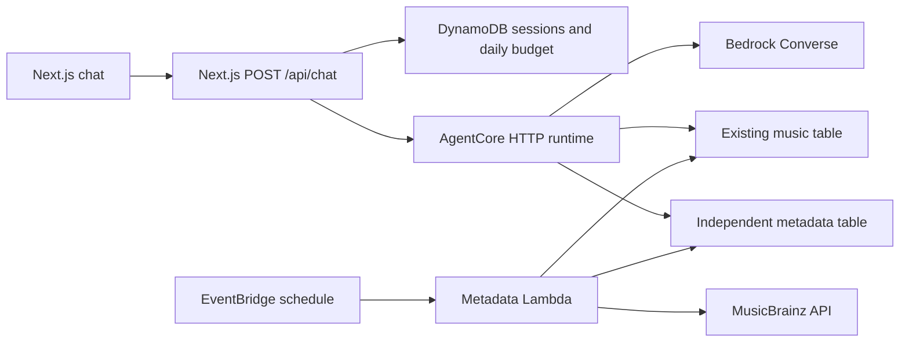

# Mood-based music companion

The page keeps the registered music list on the left and adds a chat on the right. Small screens use an expandable panel. Users describe their mood, request a different set of tracks, or ask for addictive music. Responses contain up to three existing catalog links and short reasons.

For deployment preparation, execution, and rollback, use the [deploy-ai-chat skill](../.agents/skills/deploy-ai-chat/SKILL.md).

## Architecture



The runtime implements the AgentCore HTTP contract on port 8080 (`POST /invocations`, `GET /ping`). It runs as a non-root user in an ARM64 image. Bedrock can call `search_catalog` and `submit_recommendations`; the loop is limited to three model calls. Idle runtime sessions expire after 60 seconds, with a one-hour maximum lifetime. Runtime state does not retain a transcript: the API supplies the last six completed turns from DynamoDB. A random HttpOnly cookie identifies the conversation. The API serializes requests per session and imposes a shared daily request cap (200 by default, UTC day). The cap includes failed attempts and reset requests. It is a request cap, not a monetary guarantee.

The API invokes AgentCore using the Amplify SSR compute role. Origin and JSON validation limit cross-site browser requests; origin validation is not end-user authentication. Do not expose the route independently of the application's access boundary. Secrets are never placed in public environment variables. The runtime can read the catalog and features and invoke only the configured Bedrock resources. The metadata worker cannot invoke models. No incoming provider URL is fetched by the agent or worker: the worker only calls a fixed MusicBrainz host.

## Metadata and selection

`dopamine` is addictiveness from 0 to 10. It is not happiness, energy, tempo, or a health assessment. Missing values remain unrated. Numeric filters exclude unrated tracks, and zero remains a real rating.

Provider page titles, provider URLs, contributor names, and timestamps are excluded from model input. The worker first resolves the canonical registered URL through MusicBrainz recording relationships. A fallback uses a deterministic MusicBrainz search; it accepts only a single recording with a high search score and both its title and artist present in the source title. Ambiguous versions remain unresolved. The fallback is a metadata lookup, not an LLM request.

Only independently retrieved MusicBrainz titles, artist credits, positive-vote tags, provenance, and internal catalog IDs enter the model catalog. Spotify content is not supplied to Bedrock. MusicBrainz attribution is shown in the chat. Consult the upstream [MusicBrainz data license](https://musicbrainz.org/doc/About/Data_License) when reusing or distributing its metadata; the public repository contains no downloaded catalog.

Mood matching happens during the conversation using the independent metadata and the model's knowledge of identified recordings. It is an estimate, not audio analysis. No mood tags require manual entry. Unresolved recordings remain eligible for explicit addictiveness requests, but the model is instructed not to claim a mood match for them. Unknown or deleted IDs cannot become links: both the agent and API check catalog membership, and the API resolves links from the current database.

The worker runs every 15 minutes, processing at most 25 due records per invocation. Known matches refresh after seven days; unresolved records retry after one day. A title or URL change invalidates cached metadata immediately through a fingerprint. A changed addictiveness rating takes effect on the next catalog read. Upstream failures preserve existing metadata, retry after an hour, and produce a Lambda error alarm. The worker uses a single concurrent execution and spaces MusicBrainz requests by at least 1.1 seconds.

## Boundaries and limitations

- MusicBrainz coverage is not universal. No real-catalog coverage or recommendation quality claim is made by the fixture tests. Check the matched/unknown counts after deployment and review a representative set of recommendations.
- Mood suitability, recording identification, and generated explanations can be wrong. The UI identifies mood suitability as estimated. Tags and conversation text are treated as untrusted data in the system prompt.
- The current runtime is capped at 300 catalog records and 120,000 serialized catalog characters. Expand retrieval before increasing beyond that limit.
- Responses are delivered when complete. The API aborts the AgentCore request after 45 seconds; the UI times out after 55 seconds. Client cancellation does not guarantee cancellation of remote inference.
- Up to six turns are stored server-side with a rolling 24-hour TTL. DynamoDB TTL deletion is asynchronous. Logs contain failure types and worker counts, not transcript or catalog contents. The browser transcript is held in memory and clears on reload; the next message then starts with fresh context.
- Model text is rendered as plain text. Only validated HTTPS links to supported music hosts are clickable.
- `infra/bootstrap` owns the private state bucket and ECR repository; `infra/app` owns the added services. The existing music table and Amplify application are referenced, not recreated.
- Terraform pins providers through checked-in lock files. Python dependencies are pinned. Deployment uses an immutable image digest. Update and retest dependencies deliberately.

## Validation

```sh
mise exec -- pnpm test:unit
mise exec -- pnpm lint
mise exec -- pnpm tsc --noEmit
mise exec -- pnpm build
mise exec -- python3 -m unittest discover -s tests -v  # Run from agent/.
mise exec -- terraform -chdir=infra/app init -backend=false
mise exec -- terraform -chdir=infra/app validate
mise exec -- terraform -chdir=infra/bootstrap init
mise exec -- terraform -chdir=infra/bootstrap validate
```

HTTP runtime tests additionally run inside the built agent container, using loopback requests and mocked AWS clients.

For isolated UI checks, run `mise exec -- pnpm storybook --ci --no-open`, then `mise exec -- pnpm test:chat-ui`. The browser tests intercept `/api/chat` and use fictional tracks; they do not access AWS. Screenshots are written under `/tmp`.

Before release, exercise a real conversation against the deployed model, a follow-up request, missing metadata, an empty catalog, and a worker failure. Check that returned IDs exist, reasons reflect available evidence, and p95 latency stays within the host's request timeout. Test the selected model's Converse tool support and regional availability. A successful local build or Terraform validation does not establish AWS permissions, model availability, metadata coverage, or end-to-end latency.

## References

- [AgentCore HTTP contract](https://docs.aws.amazon.com/bedrock-agentcore/latest/devguide/runtime-http-protocol-contract.html)
- [InvokeAgentRuntime](https://docs.aws.amazon.com/bedrock-agentcore/latest/devguide/runtime-invoke-agent.html)
- [Terraform AgentCore runtime](https://registry.terraform.io/providers/hashicorp/aws/latest/docs/resources/bedrockagentcore_agent_runtime)
- [MusicBrainz API](https://musicbrainz.org/doc/MusicBrainz_API)
- [MusicBrainz rate limits](https://musicbrainz.org/doc/MusicBrainz_API/Rate_Limiting)
- [Spotify developer policy](https://developer.spotify.com/policy)
