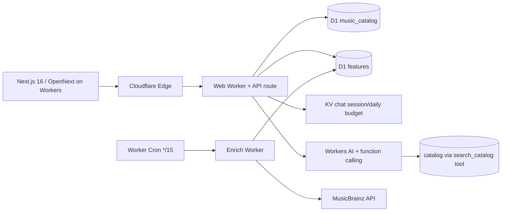

# AWS → Cloudflare 移行（IaC 技術選定）

> 対象 issue: [#1 [Infra] AWS から Cloudflare へインフラ移行](https://github.com/tomonop551/music-url-viewer/issues/1)

このドキュメントは移行の前提になる **①Cloudflare 適性の調査結果** と **②IaC 技術選定** を記録する。インフラを Cloudflare 一社に寄せることを前提に、コスト・運用のシンプル化を第一優先とする。

## 1. 結論

- **Cloudflare は本アプリに妥当。** 調査で「Cloudflare では扱えない/不利になる」要件は見当たらなかった。コスト・運用シンプル化の目的と整合し、移行を推奨する（根拠は §4）。
- **IaC は `wrangler.toml` 単体を採用**（アプリ層の単一ソースオブトゥルース）。アカウント層の初期化はセットアップ手順で固定し、Terraform/OpenTofu は今は持ち込まない。将来の要求が出たら OpenTofu へ昇格する（§3）。

## 2. 移行先アーキテクチャ

| 層 | AWS（移行元） | Cloudflare（移行先） |
|---|---|---|
| Web | Amplify Hosting（Next.js 16 SSR+ISR） | `@opennextjs/cloudflare` on Workers（SSR/ISR 対応） |
| DB catalog | DynamoDB `MusicUrls` | D1（SQLite, `message_id` PK + timestamp index） |
| DB features | DynamoDB `${name}-features` | D1 |
| DB chat | DynamoDB `${name}-chat`（TTL） | KV（expiry で TTL 相当） |
| AI chat | Bedrock AgentCore + ECR Python コンテナ | Workers AI（function calling）＋ `@cloudflare/ai-utils` |
| 定期処理 | Lambda + EventBridge rate(15min) | Worker Cron `*/15 * * * *` |
| IaC | Terraform（`infra/app` + `infra/bootstrap`） | `wrangler.toml` ＋ セットアップ手順（§3） |
| シークレット | Amplify/IAM 環境変数 | `wrangler secret put` |

## 3. IaC 技術選定

### 判断基準
- 移行目的が「コスト・運用シンプル化」。**IaC 層を増やすこと自体がオペレーションを増やす**ため、必要最小限のレイヤー数を第一に採点した。
- 移行元が Terraform であることは IaC への習熟を示すが、Cloudflare に Terraform を持ち込むと「アプリ層(wrangler)＋アカウント層(TF)」の2層管理になる。規模が小さい本プロジェクトではデメリットが勝る。

### 採用： `wrangler.toml` 単体
- **アプリ層 = `wrangler.toml` を単一ソースオブトゥルース**として集約:
  - D1 / KV / R2 バインディング、変数、Cron Trigger、routes
  - シークレットは `wrangler secret put`（バージョン管理外、実値はコミットしない）
  - `wrangler dev` と本番が同一定義になり、デプロイは `wrangler deploy` のみ
- **アカウント層（`wrangler.toml` だけで宣言できない部分）は初期化手順として固定**し、`infra/`（Terraform）は撤去:
  - D1 DB 作成: `wrangler d1 create music_catalog` / `music_features`
  - KV namespace 作成: `wrangler kv namespace create chat`
  - カスタムドメイン/DNS は Cloudflare dashboard or `wrangler pages project` で管理
  - 手順は `scripts/setup-cloudflare.sh` に集約し、冪等に近い作りにする

### 発展パス（今は導入しない）
dev/prod 分離、複数環境、破壊的変更の plan/apply 差分レビューが本格化したら、**アカウント層のみ OpenTofu + `cloudflare/cloudflare` provider** へ昇格。プロバイダの資源網羅（Workers/D1/KV/R2/DNS/Zero Trust）は申し分ない。この判断は issue 冒頭の「CF Terraform provider は任意」と整合する。

## 4. Cloudflare 適性の調査結果

### 4.1 Web ホスティング（Next.js 16）— 対応可能
- 旧 `@cloudflare/next-on-pages` は Next 16 で**非推奨**。現行の公式推奨は **`@opennextjs/cloudflare`（OpenNext）**。SSR・ISR（stale-while-revalidate）・App Router・Route Handler・Turbopack・Composable Caching に対応（2026-09 時点、v1.20.x で活発更新）。
- 本リポジトリは `proxy.ts` / `middleware.ts` を使用していないため、OpenNext が一時対応だった Node middleware ブロッカーは該当しない。
- 注意: 画像最適化（`next/image`）を使うなら Cloudflare Images 設定、または `images.unoptimized` の判断が必要。

### 4.2 AI エージェント — 移植リスク低
- `agent/recommender.py` は**純粋な Bedrock Converse の tool-call ループ**（`search_catalog` / `submit_recommendations` の2ツール）。`requirements.txt` は boto3 系のみで、pandas / sklearn 等の重い数値依存は**無い**。
- Workers AI は **function calling 対応モデル**（`@cf/moonshotai/kimi-k2.7`, `@cf/zai-org/glm-*`, `@cf/openai/gpt-oss-*`, `deepseek-v4` 系）を持ち、`@cloudflare/ai-utils` で同じ tool-call パターンをそのまま再現できる。
- 注意: Bedrock のモデル → Workers AI 提供モデルへの差し替えで**推奨品質は変わり得る**。強いモデルが必要になった場合は AI Gateway 経由で OpenAI / Anthropic 等へフォールバックできる（モデル選択が Cloudflare 提供に閉じるわけではない）。

### 4.3 DB / 定期処理
- catalog / features は**読み取り中心・件数小**のため D1（SQLite）で自然に置き換えられる。Scan → `SELECT ... ORDER BY timestamp DESC`、BatchGet → `WHERE message_id IN (...)`。
- chat（履歴・日次枠・TTL）は **KV の expiry** を使う方が素直（D1 はネイティブ TTL を持たず、清掃 Worker が必要になる）。issue 案の「D1 + 清掃 Worker」でも実現自体は可能だが、KV を第一候補とする。
- Cron 15 分は最小 1 分以上で成立する。**ただし Cron の CPU は Free が 10ms/発火で不足するため Workers Paid($5/mo) が実質必須**。それでも AWS（Amplify + DynamoDB + Bedrock + ECR/Lambda）より大幅に安い。

### 4.4 主なリスク（論点として管理）
- **lift-and-shift ではなく rewrite** になる: DDB→D1 のリレーショナル再設計、Python エージェント→TS 移植、Bedrock→Workers AI 差し替え。並行稼働→ DNS 切替で影響を抑える。
- MusicBrainz 取り込みは Worker の egress IP（データセンター IP）から行うことになるが、MusicBrainz はユーザーエージェントと rate で運用されており、15 分間隔では実用的に問題ない。`musicbrainz_user_agent` は Worker 環境変数として引き継ぐ。
- セッション・日次枠・レート制限の Workers 側再実装は既存 `-chat` テーブルの構造に依存するため、単体テスト（vitest）資産を活かして挙動を固定しながら進める。

## 5. 参照
- Cloudflare Workers Next.js guide（OpenNext / ISR）— https://developers.cloudflare.com/workers/framework-guides/web-apps/nextjs/
- OpenNext Cloudflare adapter 仕様 — https://opennext.js.org/cloudflare
- Cloudflare Workers AI function calling — https://developers.cloudflare.com/workers-ai/features/function-calling/
- Cloudflare Workers 制限 — https://developers.cloudflare.com/workers/platform/limits/